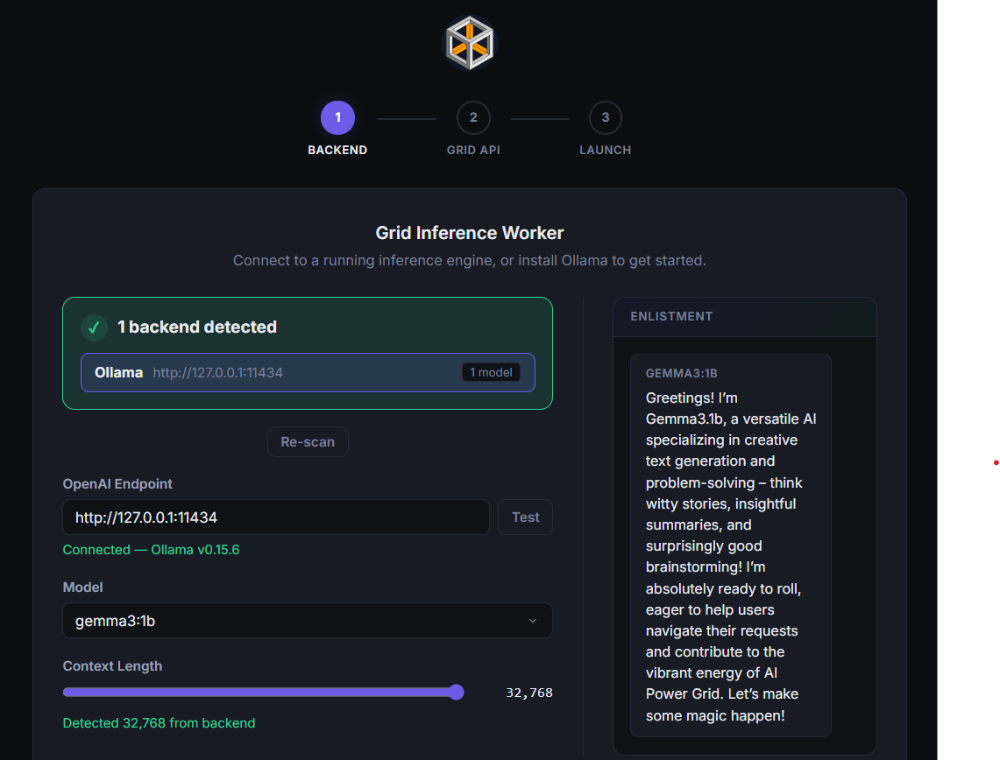

# Grid Inference Worker

Turn-key text inference worker for [AI Power Grid](https://aipowergrid.io). Run a local model, connect to the Grid, and start earning.



## Download

Grab the latest binary for your platform from [Releases](https://github.com/AIPowerGrid/grid-text-worker/releases):

Release candidates include `SHA256SUMS`, `worker-release.json`, an SPDX SBOM,
and GitHub build-provenance attestations. The candidate manifest records
macOS and Windows signing state explicitly. Every release requires supervised
staging; platform signing is recommended but optional. Unsigned builds are
identified in the manifest and release notes so operators can make an informed
choice. Published releases are immutable; corrections are issued as a new
version rather than replacing a tag or binary.

| Platform | File |
|----------|------|
| Windows x64 | `grid-inference-worker-windows-x64.exe` |
| macOS ARM64 | `grid-inference-worker-macos-arm64.zip` |
| Linux x64 (Ubuntu 22.04+) | `grid-inference-worker-linux-x64` |
| Linux ARM64 (Ubuntu 24.04+) | `grid-inference-worker-linux-arm64` |

**Windows** — Double-click the exe. A setup wizard opens in your browser at `http://localhost:7861`.

**macOS** — Unzip, then open `Grid Inference Worker.app`.

**Linux** — `chmod +x grid-inference-worker-linux-x64 && ./grid-inference-worker-linux-x64`

No Python or dependencies needed. Just install a backend (Ollama is easiest),
run the worker, and follow the wizard. For a normal single-model worker, enter a
worker name and choose **Connect Grid account**. The worker opens Console for
Google or wallet sign-in and installs a worker-only credential after approval;
the generated key never enters the browser and cannot spend credits or manage
your account.

Advanced multi-backend or parallel operators can instead use an existing Grid
API key from the [developer console](https://console.aipowergrid.io/dashboard/api-key).

The wizard confirms a Grid registration before reporting success. A running
process alone is not an online worker. The dashboard distinguishes connecting,
partially connected, online, and unavailable status. If setup cannot confirm a
connection, open Logs and check the backend, API key, and worker name; saving
configuration does not prove a job has completed.

Payouts use the account that approved the worker credential or owns the API key.
Manage the payout wallet in
[console settings](https://console.aipowergrid.io/dashboard/settings), not in the
worker. The legacy local `WALLET_ADDRESS` setting does not set a Grid payout
destination. Do not enter a wallet private key in this application.

The desktop manager can copy an authenticated dashboard link for another local
browser. In headless mode, run `grid-inference-worker --show-dashboard-link`
explicitly; normal startup logs never print the dashboard token.

Once your worker is running, chat with your model at [aipg.chat](https://aipg.chat) — select your model in the upper selector.

## CLI Flags

Override config from the command line. The web dashboard is always available at `http://localhost:7861` regardless of how you start the worker.

```bash
grid-inference-worker \
  --model llama3.2:3b \
  --backend-url http://127.0.0.1:11434 \
  --api-key YOUR_API_KEY \
  --worker-name my-worker
```

```
--model NAME            Model name (e.g. llama3.2:3b)
--backend-url URL       Backend URL (e.g. http://127.0.0.1:11434)
--api-key KEY           Grid API key
--worker-name NAME      Worker name on the grid
--port PORT             Web dashboard port (default: 7861)
--host HOST             Dashboard bind host (default: 127.0.0.1)
--gui                   Show the desktop control window (default for binaries)
--no-gui                Skip the desktop control window
--install-service       Install as a system service (auto-start on boot)
--uninstall-service     Remove the system service
--service-status        Check if the service is installed
```

## Environment Variables

Copy `.env.example` to `.env` and fill in your values, or configure through the web setup wizard.

| Variable | Default | Description |
|----------|---------|-------------|
| `GRID_API_KEY` | *(required unless enrolled)* | Grid API key for advanced/manual setup ([create one](https://console.aipowergrid.io/dashboard/api-key)) |
| `GRID_ENROLLED_WORKER_NAME` | | Exact worker name installed by secure Console enrollment; do not set manually |
| `MODEL_NAME` | | Model to serve (e.g. `llama3.2:3b`) |
| `BACKEND_TYPE` | `ollama` | `ollama` or `openai` |
| `OLLAMA_URL` | `http://127.0.0.1:11434` | Ollama endpoint |
| `OPENAI_URL` | `http://127.0.0.1:8000/v1` | OpenAI-compatible endpoint (vLLM, SGLang, etc.) |
| `OPENAI_API_KEY` | | API key for OpenAI-compatible backend |
| `GRID_WORKER_NAME` | `Text-Inference-Worker` | Worker name on the grid |
| `GRID_MAX_LENGTH` | `32768` | Fallback output-token budget when the request omits one |
| `GRID_MAX_CONTEXT_LENGTH` | `131072` | Maximum advertised context window (auto-detected when possible) |
| `GRID_NSFW` | `true` | Accept NSFW jobs |
| `WALLET_ADDRESS` | | Legacy local value; does not control Grid payouts |

## Run from Source

Requires Python 3.11+.

```bash
pip install -e .
grid-inference-worker
```

On Windows you can also use:

```powershell
.\scripts\run.ps1
```

## Docker

```bash
cp .env.example .env
# Edit .env with your values
docker compose up -d
```

The dashboard is available at `http://localhost:7861` and binds to loopback by
default. Use `--host 0.0.0.0` only when you deliberately need LAN access; the
generated dashboard token is still required.

## Install as a Service

Run the worker on boot without needing to stay logged in. Works on Windows (startup registry), Linux (systemd), and macOS (launchd).

```bash
# Configure the worker first (run it once to set up .env), then:
grid-inference-worker --install-service

# Check status
grid-inference-worker --service-status

# Remove
grid-inference-worker --uninstall-service
```

## Supported Backends

| Backend | Type | Setup |
|---------|------|-------|
| [Ollama](https://ollama.com) | `ollama` | Install Ollama, `ollama pull llama3.2:3b`, done |
| [LM Studio](https://lmstudio.ai) | `ollama` | Load a model, enable server in Developer tab |
| [vLLM](https://github.com/vllm-project/vllm) | `openai` | `--served-model-name` + set `OPENAI_URL` |
| [SGLang](https://github.com/sgl-project/sglang) | `openai` | Point `OPENAI_URL` at SGLang's OpenAI endpoint |
| [LMDeploy](https://github.com/InternLM/lmdeploy) | `openai` | `lmdeploy serve api_server` + set `OPENAI_URL` |
| [KoboldCpp](https://github.com/LostRuins/koboldcpp) | `openai` | Enable OpenAI-compatible endpoint |

**Ollama** is the easiest way to get started. The setup wizard auto-detects it and lets you pick a model.

For any backend that exposes an **OpenAI-compatible API** (`/v1/chat/completions`), set `BACKEND_TYPE=openai` and point `OPENAI_URL` at it.

### vLLM Documentation

For high-performance inference with vLLM, see our detailed guides:

- **[vLLM Setup Guide](docs/vllm-setup-guide.md)** - Installation, configuration, and integration
- **[vLLM Optimization Guide](docs/vllm-optimization-guide.md)** - Performance tuning, benchmarking, and production best practices
